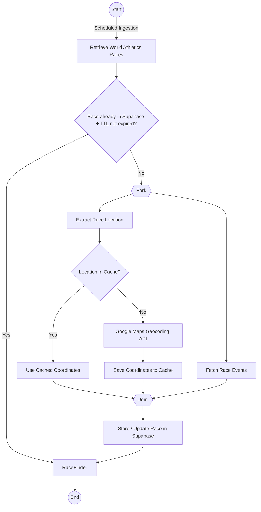

# Racefinder

**Find certified races and discover your next opportunity to run a qualifying time.**

**Racefinder** is a race discovery platform that aggregates events from the **World Athletics Event Calendar**, enriches them with geographic data, and makes them searchable on an interactive map.

Whether you're chasing a qualifying standard, planning your racing calendar, or simply looking for your next race, Racefinder helps you find the right event.

## Features

### 🔄 Automatic Race Ingestion
Race data is automatically collected from the World Athletics Event Calendar on a scheduled basis, keeping the race database synchronised with the latest available event information.

### 🗺️ Geographic Race Discovery
Racefinder converts race locations into geographic coordinates using the **Google Maps Geocoding API**.

Geocoded locations are cached, allowing races to be displayed accurately on an interactive map while keeping geocoding costs and API usage under control

### 🔎 Search & Filtering
Find your ideal race by filtering by:
* Event
* Country
* Date range

## Architecture

## Tech Stack

| Component | Technology |
| :---: | :---: |
| Backend | Spring Boot |
| Database | PostgreSQL / Supabase |
| Data | World Athletics API / GraphQL|
| Geocoding | Google Maps Geocoding API |
| Frontend | *Coming Soon* |

## Demo
**Coming Soon!**
